# Mavros 教程-offboard模式下自主飞行

# 来自: 阿木实验室

# 0. 疑问

# 1.1 工具链安装

# 1.2 ROS 创建节点和编译

# 1.3 ROS 编程基础

# 1.4 Mavros 消息的订阅与发布

# 2.1 位置控制

确认需要用到的mavros 话题  （服务） 的名称以及对应的消息类型

# 2.2 姿态控制

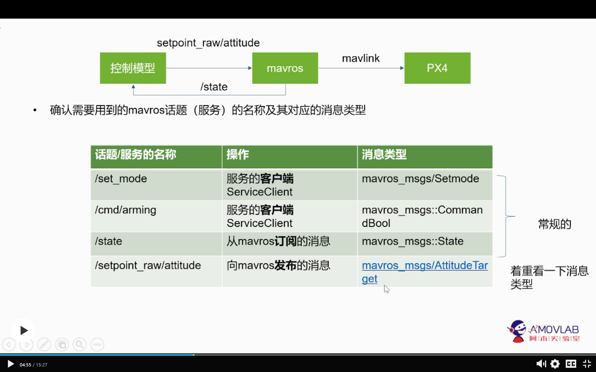

# 2.3 获取传感器数据

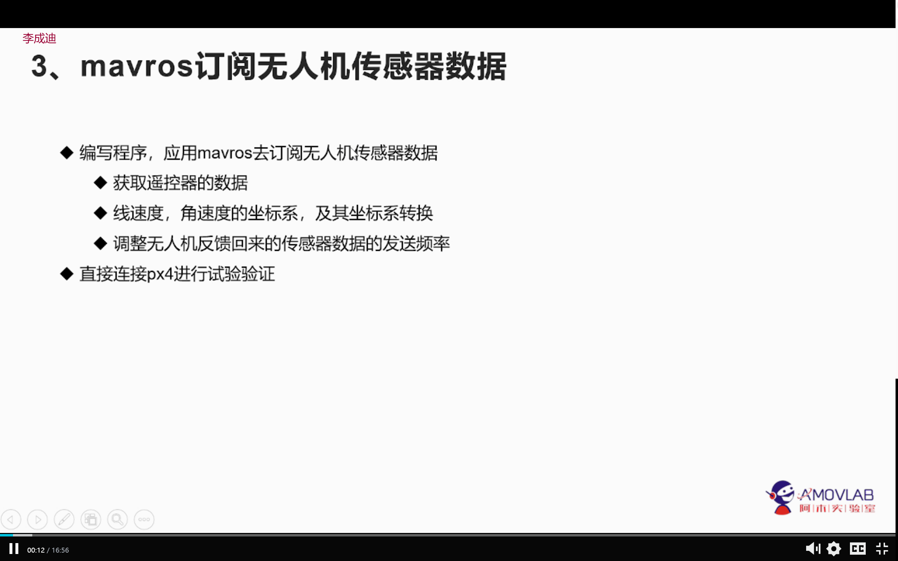

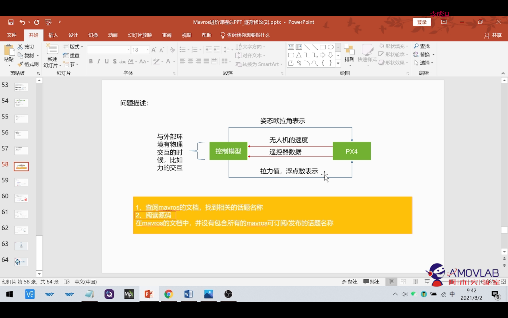

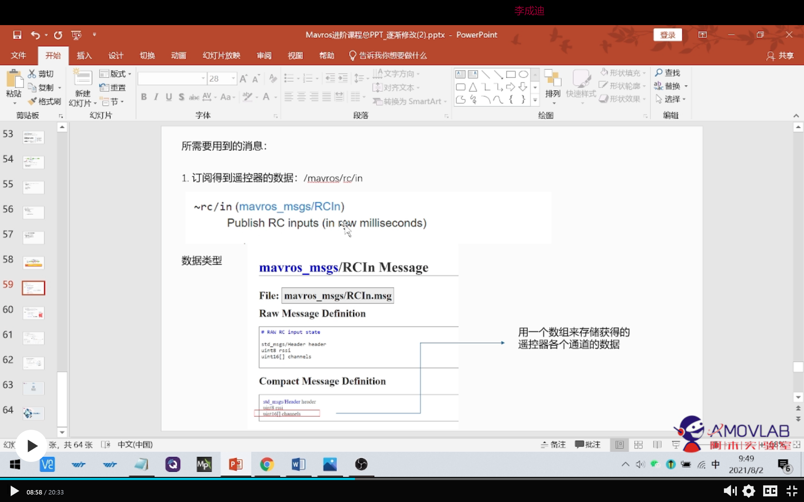

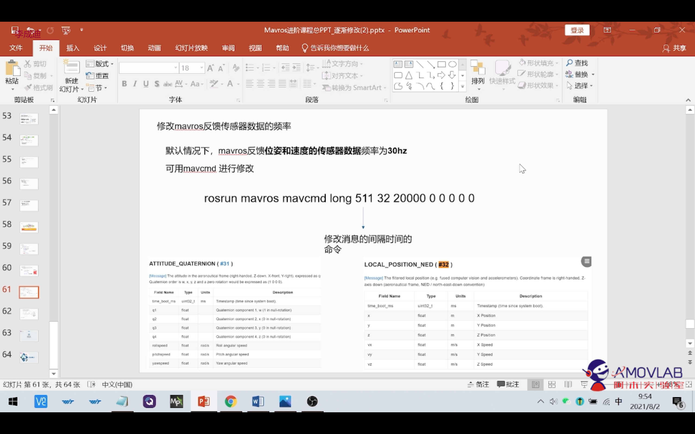

姿态修正：频率为30hz ，建议50hz 以上，如何查看hz？

# 2.4 室内定位

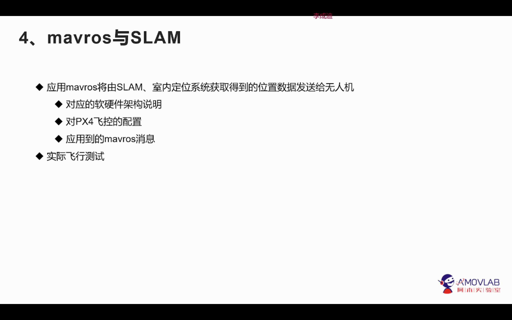

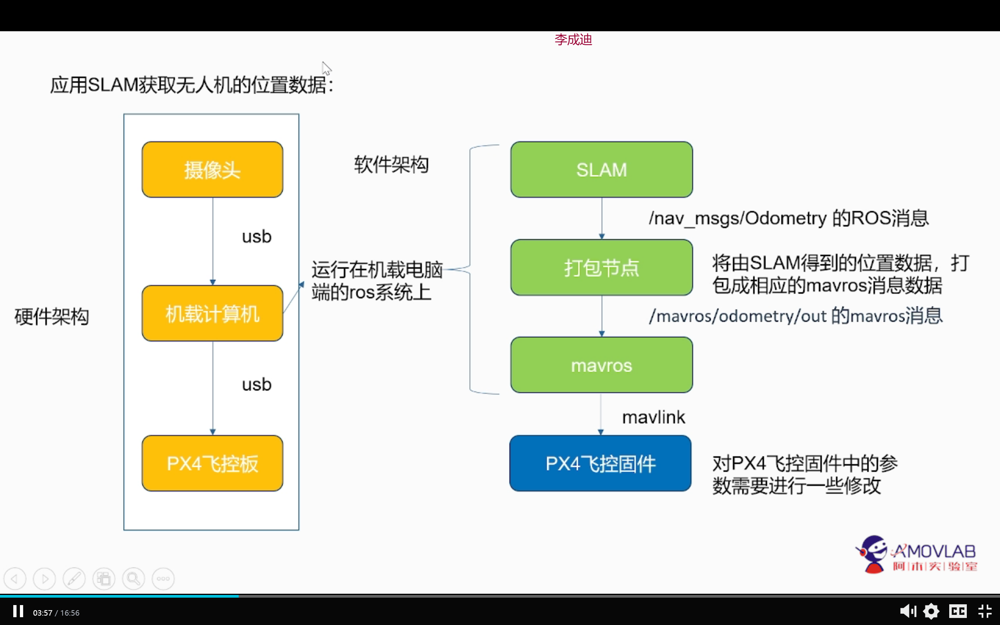

·

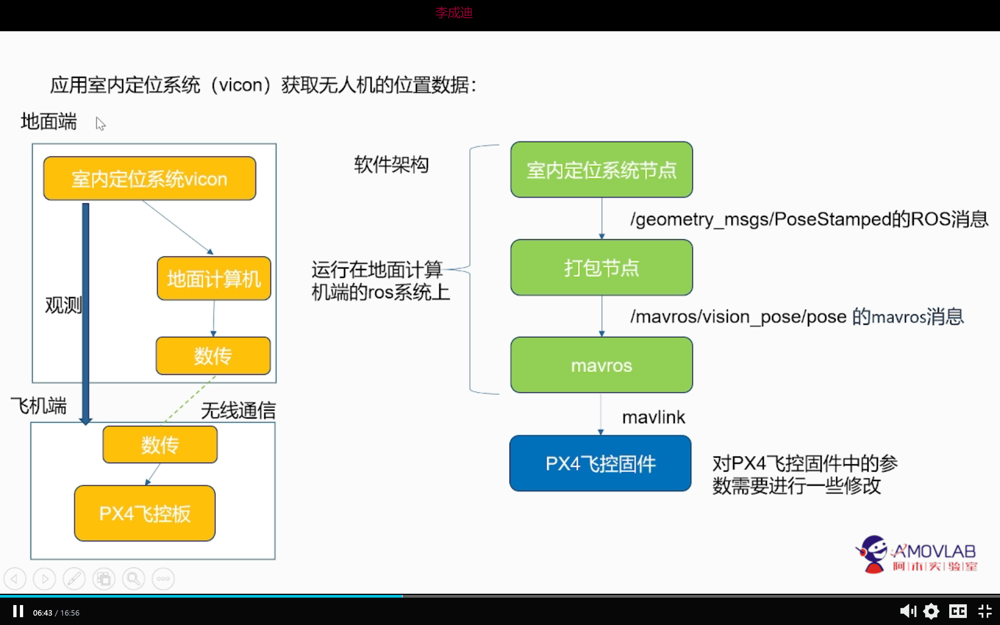

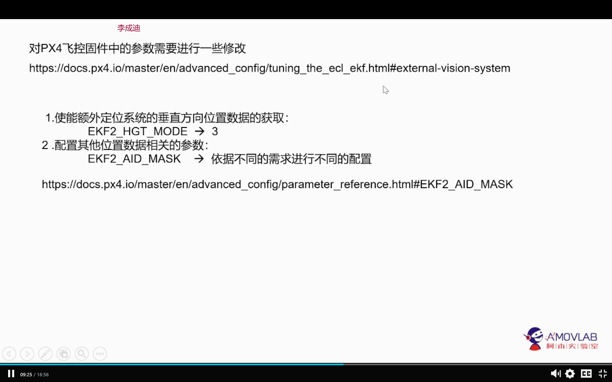

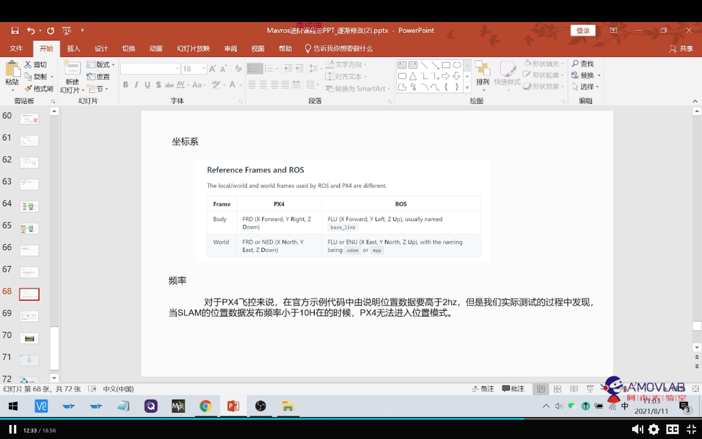

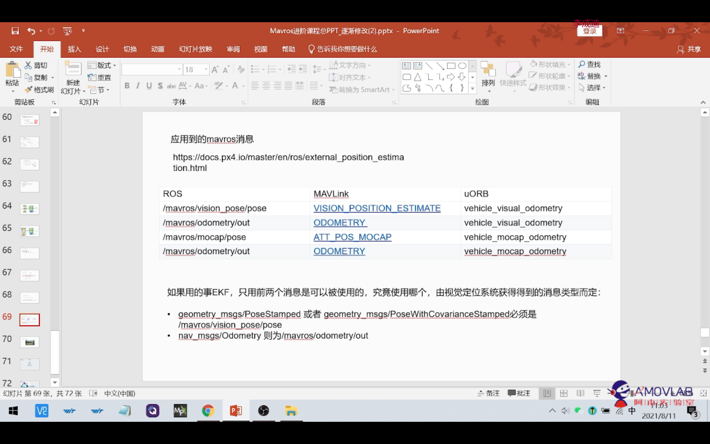

# 2.5 总结引申 

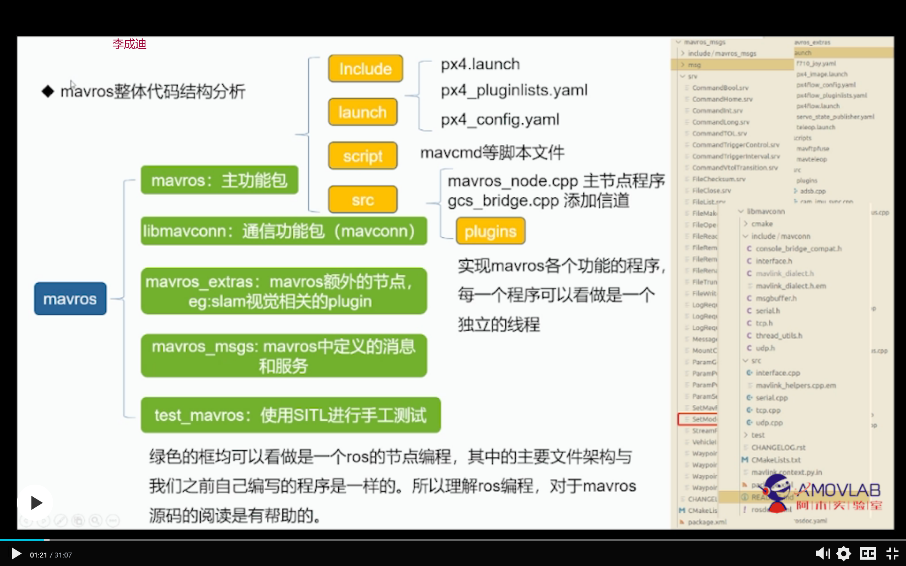

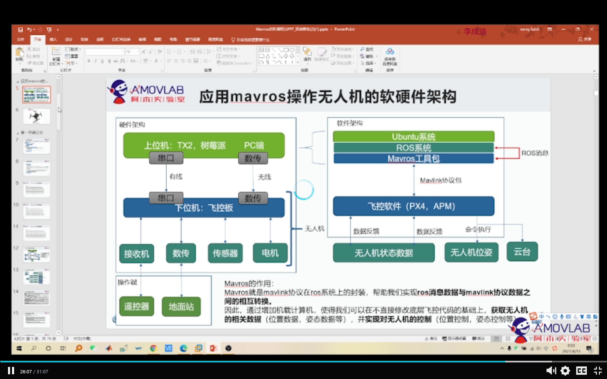

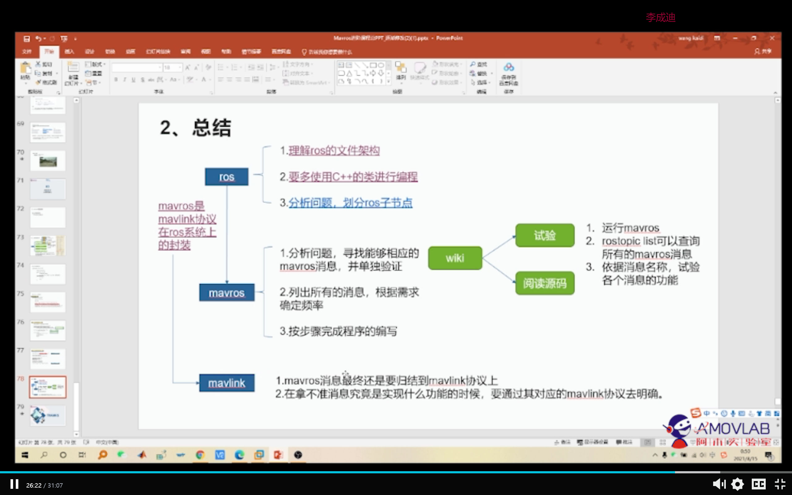

# 2.6 注意点

- 采用usb 接线方式，需要改变px4中的某个数据，取消usb检测，px4若进行
- Mavros 反馈来的速度数据的坐标为北西天坐标系不是位置数据的ENU坐标系

# 3.0 px4_command 分析

- **此为px4_ command 开源功能包解析**

  px4_command功能包是一个基于PX4开源固件及Mavros功能包的开源项目，旨在为PX4开发者提供更加简洁快速的开发体验。 目前已集成无人机外环控制器修改、目标追踪、激光SLAM定位、双目V-SLAM定位、激光避障等上层开发代码、后续将陆续推 出涵盖任务决策、路径规划、滤波导航、单/多机控制等无人机/无人车/无人船科研及开发领域的功能。 配合板载计算机(树莓派、TX2、Nano)等运算能力比较强的处理器，来实现复杂算法的运行，运行得到的控制指令通过串口或者网口通信发送给底层控制板。 

## 1. 系统图

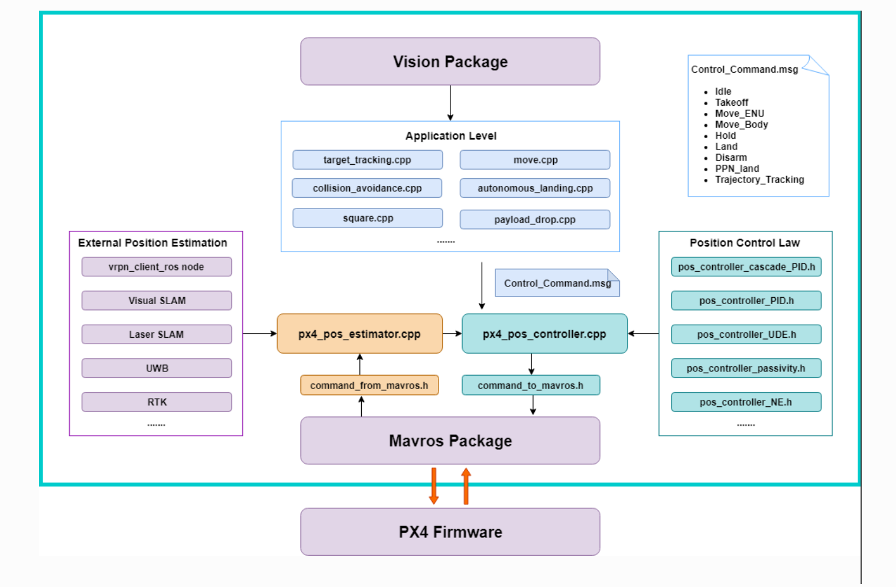

## 2. 文件分析

- **state_from_mavros.h**:订阅飞控状态,包括无人机当前的状态(/mavros/state),当前位置(/mavros/local_position/pose),当前速度(/mavros/local_position/velocity_local),和当前角度,角速度(/mavros/imu/data)
- **command_to_mavros.h**:发布px4_command功能包生成的控制量至mavros功能包,可发送期望位置,速度(本地系与机体系),角度,角速度,底层控制(遥控器输入)
- **px4_pos_estimator.cpp**:订阅激光雷达或者mocap发布的位置信息,并进行坐标转换,在state_from_mavros.h中已订阅飞控发布的位置,速度,欧拉角信息,此处直接使用,根据订阅的数据,发布相应的位置,偏航角给飞控
- **px4_pos_controller.cpp**:订阅由位置估计发布的DroneState,初始化当前飞机状态的时间.订阅ControlCommand(不知从何发布的数据).发布topic_for_log主题.在选择控制率,检查参数正确后,初始化完成.对move节点中,takeoff,Move_ENU,Move_Body,Hold,Land,Disarm,PPN_land和Trajectory_Tracking等进行逻辑处理.
- **ground_station.cpp**:订阅自定义日志主题(/px4_command/topic_for_log),订阅视觉系统位置估计PoseStamped主题(/vrpn_client_node/UAV/pose,非mavlink消息,数据包括point位置(x,y,z),四元数方向(w,x,y,z)),订阅飞控姿态四元数AttitudeTarget主题(/mavros/setpoint_raw/target_attitude,#82号mavlink消息).不断的更新视觉传感器状态,并打印当前飞机的状态.
- **px4_sender.cpp**:订阅自定义消息控制指令主题(/px4_command/control_command),机体系到惯性系坐标转换,move中控制命令的具体实现(0表示位置控制,3表示速度控制)
- **autonomous_landing.cpp**:降落识别使用xyz均为速度控制.订阅数据包括降落板与无人机的相对位置,降落板与无人机的相对偏航角,视觉flag 来自视觉节点.最后发布位置控制指令
- **collisiom_avoidance_streo.cpp**:订阅/streo_distance该数据作为计算飞机四个方向的距离判断.
- **formation_control_sitl.cpp**:多机仿真SITL,只适用于Move_ENU坐标系下,若使用Move_Body,需自行添加修改.
- **payload_drop.cpp**:订阅/mavros/local_position/pose本地位置.发布遥控器通道值.
- **square.cpp**:发布/px4_command/control_command命令.子模式xyz均为位置控制.
- **target_tracking.cpp**:
- **move.cpp**:发布/px4_command/control_command,并设置子模式xy速度控制(0b10),位置控制.z速度控制(0b01),位置控制
- **set_mode.cpp**:模拟遥控器,根据mavros服务,进行在SITL下解锁,切换offboard,控制飞行器.
- **TFmini.cpp**:激光定高雷达的处理,如果需要添加超声波传感器,可参考此代码.

