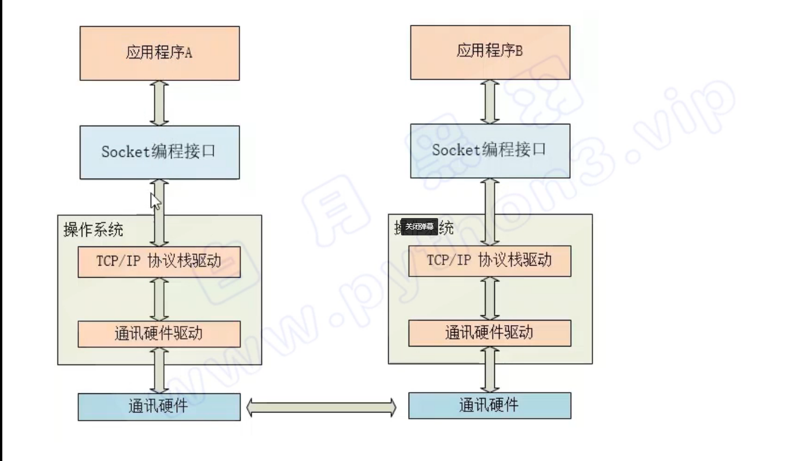
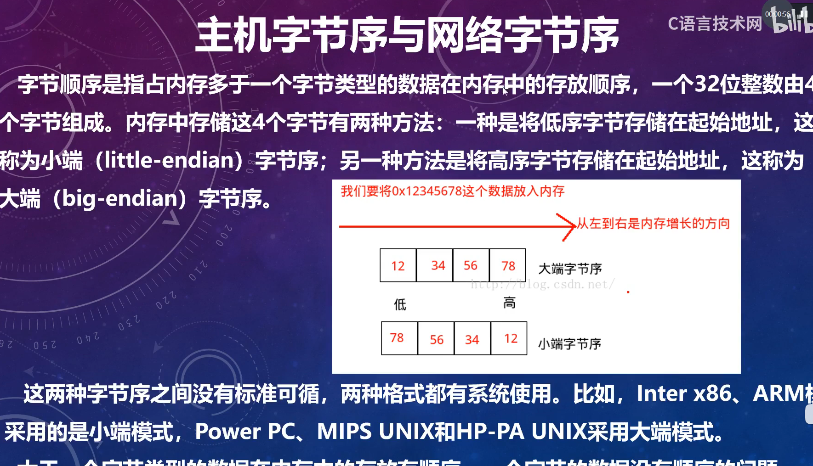
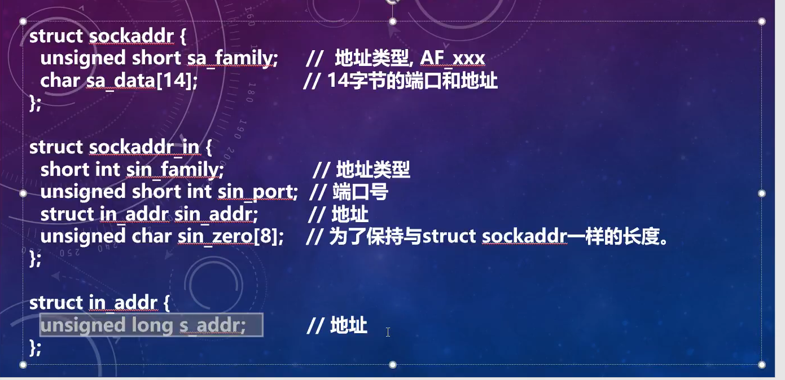
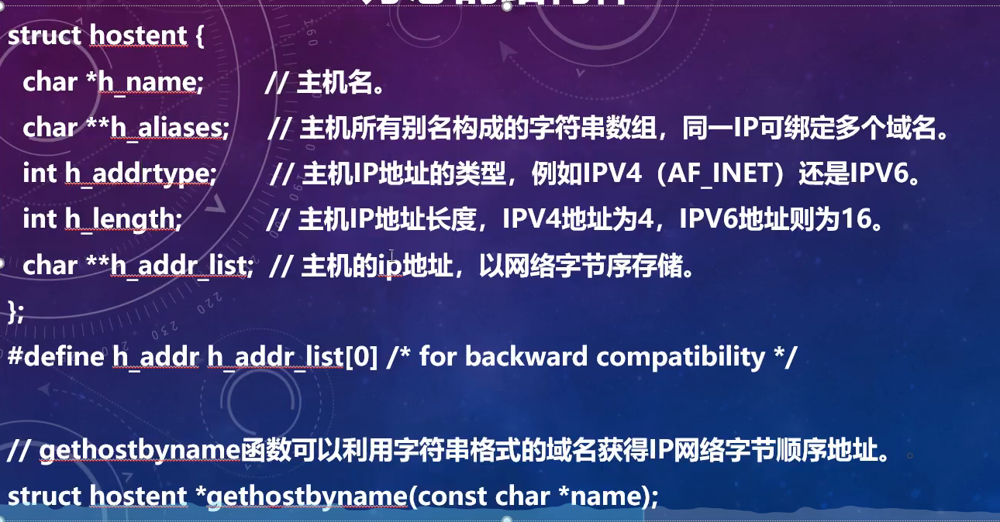
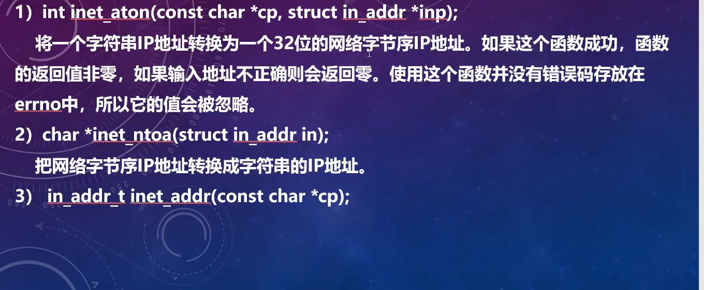
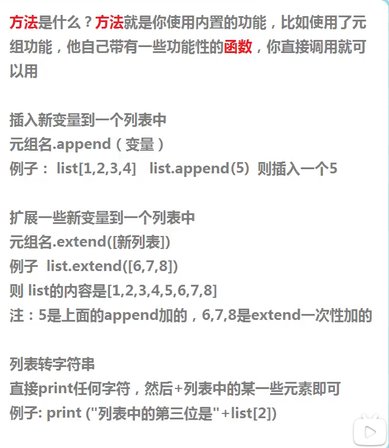

# 0.学习日期安排

JSON:    10.20-10.21号

c++ socket:   10.22号到10.31 号 

c++ socket ->qt  ->  qt    c++   socket ->  linux  python socket  ->  linux  python socket  ros

# 0.1  思路

1. shell 脚本启动无人机多个节点,包含无人机起飞需要准备的节点（px4 节点，深度相机节点，摄像头节点），socket 服务端节点。
2. 通过客户端连接无人机，案例一控制无人机，起飞，降落，航点控制，案例二 控制无人机完成比赛任务，任务按钮。
3. 无人机返回客户端，位置坐标，目标识别情况，图片信息（经处理后的图片, 可能内存或者网卡使用占用率过高)
4. socket 服务端节点，订阅 px4 节点，摄像头节点，深度相机节点，向客户端发送数据.。


# 1. 名称： 无人机中央任务调度系统

# 2.版本号： 1.0 

# 3. 开发者： 太原工业学院晋速-哪吒队

# 4. 开发工具： 

#  C++,python,qt5 ,Qtdesigner ,socket

# 5. 运行环境：

## 客户端：

vsode   + MinGW

## 服务端： 

ubuntu18.04   ros     

# 6.功能模块：

## 1. 中央任务系统

1. 比赛任务
2. 前进，后退，左转，右转，左移，右移， 起飞， 一键降落，无指令自主悬停
3. 航点规划，输入航点，自主飞行到达航点后悬停，带避障算法
4. 

## 2. 中央监控系统

1. 无人机x,y,z 坐标
2. 无人机cpu 运行占用 内存占用

## 3. 中央通信系统

 使用Socket套接字通信实现上位机与ROS机器人操作系统之间的各类消息通信 


## 4. 中央导航系统

1. 无人机x y z 坐标
2. 雷达点云图
3. 航点图
4. 发布航点，控制无人机
5. 发布起飞指令，控制无人机起飞
6. 

## 5. 中央视觉系统 

1. 摄像头图像
2. opencv 处理后的图像
3. 深感图像
4. 放完物块后的拍照 ，在靶区，w区，房子区，放下物块后，起飞后，拍照，拍下物块的俯视图，三个相框，三张图片
5.  在ros节点里或者用OpenCV调用摄像头，将视频编码后socket网络编程UDP协议实时发送给服务器端，再解码出来交给视频处理算法。最开始用的tcp协议发现有花屏现象，判断为tcp的粘包，所以改用了UDP协议实时传输视频 

# 7. 实现功能

# 8. 使用方法

# 9. 常用问题

# 10. 代码框架

# 11. 语言学习

## 1. C++

## 2.qt5


## 3.Qtdesigner 

## 4. socket (C)

### 1. 什么是socket 编程

不管是传统计算机软件，还是手机软件，还是物联网嵌入式系统软件，这些都要和其他网络系统进行通讯

而当今网络世界基本上都是使用TCP/IP 协议进行通讯的

TCP/IP 协议  就是一种 传输 数据的 方案 b



 

### 2.C/C++中的socket 编程

tcp 进行通讯的程序双方，分为服务端和客户端

tcp 协议进行通讯的双方，是需要先建立一个虚拟连接的，然后双方程序才能发送业务数据信息

建立tcp 虚拟连接时通过著名的三次握手 进行的


## 3. 相关的库函数

### 1. socket函数

socket 函数用于创建一个新的socket ，也就是向系统申请一个socket 资源，socket函数用于客户端和服务端

函数声明：

```c
int socket(int domain, int type ,int protocol);
```


domain：

即协议域，又称为协议族（family）。常用的协议族有，AF_INET、AF_INET6、AF_LOCAL（或称AF_UNIX，Unix域socket）、AF_ROUTE等等。协议族决定了socket的地址类型，在通信中必须采用对应的地址，如AF_INET决定了要用ipv4地址（32位的）与端口号（16位的）的组合、AF_UNIX决定了要用一个绝对路径名作为地址。

type：

指定socket类型。常用的socket类型有，SOCK_STREAM、SOCK_DGRAM、SOCK_RAW、SOCK_PACKET、SOCK_SEQPACKET等等（socket的类型有哪些？）。

protocol：

故名思意，就是指定协议。常用的协议有，IPPROTO_TCP、IPPTOTO_UDP、IPPROTO_SCTP、IPPROTO_TIPC等，它们分别对应TCP传输协议、UDP传输协议、STCP传输协议、TIPC传输协议。
注意：并不是上面的type和protocol可以随意组合的，如SOCK_STREAM不可以跟IPPROTO_UDP组合。当protocol为0时，会自动选择type类型对应的默认协议。


**主机字节序与网络字节序**



大于一个字节类型的数据在内存中的存放有顺序，一个字节的数据没有顺序问题

 


###  结构体








server: 服务端 

```c++
#define _CRT_SECURE_NO_WARNINGS
#define _WINSOCK_DEPRECATED_NO_WARNINGS
#include<iostream>
#include<cstdlib>
#include<cstring>
#include<winsock2.h>                  //引用头文件
#pragma comment(lib,"ws2_32.lib")     //链接库文件


using namespace std;

char Ip[20][200] = { '\0' };
int iConnect = 0;                     //当前客户端数量

/*
DWORD是无符号的,相当于unsigned long ，它是MFC的数据类型。DWORD一般用于返回值不会出现负值情况
WINAPI是一个宏，所代表的符号是__stdcall, 函数名前加上这个符号表示这个函数的调用约定是标准调用约定，windows API函数采用这种调用约定
LPVOID是一个没有类型的指针，也就是说你可以将任意类型的指针赋值给LPVOID类型的变量（一般作为参数传递），然后在使用的时候再转换回来。 可以将其理解为long型的指针，指向void型
*/

DWORD WINAPI threadpro(LPVOID pParam)           //创建多线程函数，函数返回值为DWORD WINAPI
{
	SOCKET hsock = (SOCKET)pParam;              //把pParam转换为SOCKET型指针
	char buffer[1024];
	char sendBuffer[1024];
	if (hsock != INVALID_SOCKET)                //INVALID_SOCKET表示无效
		cout << "Start receive information from IP:" << Ip[iConnect] << endl << endl;
	while (true)                                                  //循环接收发送的内容
	{

		int num = recv(hsock, buffer, 1024, 0);                   //阻塞函数,等待接受内容
		if (num <= 0)
		{
			cout << "Client with IP:" << Ip[iConnect] << " disconnected!" << endl << endl;
			break;
		}
		if (num >= 0)
			cout << "Information from:" << Ip[iConnect] << ":" << buffer << endl << endl;
		if (!strcmp(buffer, "AAA"))           //如果接受到 AAA 返回 BBB
		{
			memset(sendBuffer, 0, 1024);
			strcpy(sendBuffer, "BBB");
			int ires = send(hsock, sendBuffer, sizeof(sendBuffer), 0);         //回送信息
			cout << "The message sent to IP:" << Ip[iConnect] << "is: " << sendBuffer << endl << endl << endl;
		}
		else if (!strcmp(buffer, "CCC"))      //如果接受到 CCC 返回 DDD
		{
			memset(sendBuffer, 0, 1024);
			strcpy(sendBuffer, "DDD");
			int ires = send(hsock, sendBuffer, sizeof(sendBuffer), 0);         //回送信息
			cout << "The message sent to IP:" << Ip[iConnect] << "is: " << sendBuffer << endl << endl << endl;
		}
		else if (!strcmp(buffer, "exit"))      //如果接受到 exit 结束该进程
		{
			cout << "Client with IP:" << Ip[iConnect] << " disconnected!" << endl;
			cout << "Server Process Close:  " << endl << endl;
			return 0;
		}
		else                //如果接受到 其它指令 返回 Commend error
		{
			memset(sendBuffer, 0, 1024);
			strcpy(sendBuffer, "Commend error");
			int ires = send(hsock, sendBuffer, sizeof(sendBuffer), 0);
			cout << "The message sent to IP:" << Ip[iConnect] << "is: " << sendBuffer << endl << endl << endl;
		}
	}
	return 0;
};
int main(void)
{
	WSADATA wsd;         //定义WSADATA对象

/*
	WSAStartup错误码介绍

	WSASYSNOTREADY  网络通信中下层的网络子系统没准备好

	WSAVERNOTSUPPORTED  Socket实现提供版本和socket需要的版本不符

	WSAEINPROGRESS  一个阻塞的Socket操作正在进行

	WSAEPROCLIM  Socket的实现超过Socket支持的任务数限制

	WSAEFAULT   lpWSAData参数不是一个合法的指针
*/

/*
	当一个应用程序调用WSAStartup函数时，操作系统根据请求的Socket版本来搜索相应的Socket库，然后绑定找到的Socket库到该应用程序中。以后应用程序就可以调用所请求的Socket库中的其它Socket函数了。该函数执行成功后返回0。
例：假如一个程序要使用2.2版本的Socket,那么程序代码如下
*/
//WSAStartup(MAKEWORD(2, 2), &wsd);    //初始化套接字

	if (WSAStartup(MAKEWORD(2, 2), &wsd))
	{
		printf("Initlalization Error!");
		return -1;
	}

	SOCKET m_SockServer;            //创建socket对象           

/*
	sockaddr_in的定义如下
	struct   sockaddr_in
	{
		short   int   sin_family;     // Address family 一般来说 AF_INET（地址族）PF_INET（协议族 ）
		unsigned   short   int   sin_port;  //sin_port存储端口号（使用网络字节顺序），在linux下，端口号的范围0~65535,同时0~1024范围的端口号已经被系统使用或保留
		struct   in_addr   sin_addr;     //存储IP地址
		unsigned   char   sin_zero[8];  //sin_zero是为了让sockaddr与sockaddr_in两个数据结构保持大小相同而保留的空字节
	};
*/

	sockaddr_in serveraddr;         //创建sockaddr_in对象储存自身信息
	sockaddr_in serveraddrfrom;

	SOCKET m_Server[20];            //创建socket数组来存放来自客户端的信息最大连接数为20

	serveraddr.sin_family = AF_INET;             //设置服务器地址家族
	serveraddr.sin_port = htons(4600);           //设置服务器端口号

/*
	inet_addr语法如下
	unsigned long PASCAL FAR inet_addr( const struct FAR* cp);

	本函数解释cp参数中的字符串，这个字符串用Internet的“.”间隔格式表示一个数字的Internet地址。
返回值可用作Internet地址。所有Internet地址以网络字节顺序返回(字节从左到右排列)
*/
	serveraddr.sin_addr.S_un.S_addr = inet_addr("127.0.0.1");

	/*
		socket的定义如下
		SOCKET WSAAPI socket(
		_In_ int af,
		_In_ int type,
		_In_ int protocol
		);

		建立一个socket用于连接
		af:address family，如AF_INET
		type:连接类型，通常是SOCK_STREAM或SOCK_DGRAM
		protocol:协议类型，通常是IPPROTO_TCP或IPPROTO_UDP
		返回值：socket的编号，为-1表示失败
	*/
	m_SockServer = socket(AF_INET, SOCK_STREAM, 0);    //创建一个临时变量并赋值给m_SockServer

/*
	bind的语法:int bind( int sockfd, struct sockaddr* addr, socklen_t addrlen)
	返回：0──成功， -1──失败

	参数sockfd
	指定地址与哪个套接字绑定，这是一个由之前的socket函数调用返回的套接字。调用bind的函数之后，该套接字与一个相应的地址关联，
发送到这个地址的数据可以通过这个套接字来读取与使用

	参数addr
	指定地址。这是一个地址结构，并且是一个已经经过填写的有效的地址结构。调用bind之后这个地址与参数sockfd指定的套接字关联，
从而实现上面所说的效果

	参数addrlen
	正如大多数socket接口一样，内核不关心地址结构，当它复制或传递地址给驱动的时候，它依据这个值来确定需要复制多少数据。
这已经成为socket接口中最常见的参数之一了

*/
	int i = bind(m_SockServer, (sockaddr*)&serveraddr, sizeof(serveraddr));    //把名字和套接字绑定
	cout << "bind:" << i << endl << endl;

	int iMaxConnect = 20;           //最大连接数
	int iLisRet;
	char buf[] = "THIS IS SERVER\0";
	char WarnBuf[] = "It,is voer Max connect\0";
	int len = sizeof(serveraddr);            //serveraddr所占的字节大小

	while (true)
	{
		/*
			listen函数在一般在调用bind之后-调用accept之前调用，语法如下：
			int listen(int sockfd, int backlog)
			返回：0──成功， -1──失败

			参数sockfd
			被listen函数作用的套接字，sockfd之前由socket函数返回。在被socket函数返回的套接字fd之时，它是一个主动连接的套接字，也就是此时系统假设用户会对这个套接字调用connect函数，
		期待它主动与其它进程连接，然后在服务器编程中，用户希望这个套接字可以接受外来的连接请求，也就是被动等待用户来连接。由于系统默认时认为一个套接字是主动连接的，
		所以需要通过某种方式来告诉系统，用户进程通过系统调用listen来完成这件事

			参数backlog
			这个参数涉及到一些网络的细节。在进程正理一个一个连接请求的时候，可能还存在其它的连接请求。因为TCP连接是一个过程，所以可能存在一种半连接的状态，
		有时由于同时尝试连接的用户过多，使得服务器进程无法快速地完成连接请求。如果这个情况出现了，服务器进程希望内核如何处理呢？
		内核会在自己的进程空间里维护一个队列以跟踪这些完成的连接但服务器进程还没有接手处理或正在进行的连接，这样的一个队列内核不可能让其任意大，所以必须有一个大小的上限。这个backlog告诉内核使用这个数值作为上限。
		服务器进程不能随便指定一个数值，内核有一个许可的范围。这个范围是实现相关的。很难有某种统一，一般这个值会小30以内
		*/
		iLisRet = listen(m_SockServer, 0);    //进行监听

/*

	accept语法如下:
	SOCKET accept(SOCKET sock, struct sockaddr *addr, int *addrlen);

	它的参数与 listen() 和 connect() 是相同的：sock 为服务器端套接字，addr 为 sockaddr_in 结构体变量，
addrlen 为参数 addr 的长度，可由 sizeof() 求得

	accept() 返回一个新的套接字来和客户端通信，addr 保存了客户端的IP地址和端口号，而 sock 是服务器端的套接字，
大家注意区分。后面和客户端通信时，要使用这个新生成的套接字，而不是原来服务器端的套接字。

	accept()系统调用主要用在基于连接的套接字类型，比如SOCK_STREAM和SOCK_SEQPACKET。它提取出所监听套接字的等待连接队列中第一个连接请求，
创建一个新的套接字，并返回指向该套接字的文件描述符。新建立的套接字不在监听状态，原来所监听的套接字也不受该系统调用的影响

备注：新建立的套接字准备发送send()和接收数据recv()

*/
		int temp = 0;
		int Len = sizeof(serveraddrfrom);
		m_Server[iConnect] = accept(m_SockServer, (sockaddr*)&serveraddrfrom, &len);

		if (m_Server[iConnect] != INVALID_SOCKET)  //INVALID_SOCKET表示无效 
		{
			//int getsockname(int sockfd, struct sockaddr *localaddr, socklen_t *addrlen)

			if (getsockname(m_Server[iConnect], (struct sockaddr*)&serveraddrfrom, &Len) != -1)
			{

				printf("listen address = %s:%d\n", inet_ntoa(serveraddrfrom.sin_addr), ntohs(serveraddrfrom.sin_port));
				sprintf(Ip[iConnect], "%s", inet_ntoa(serveraddrfrom.sin_addr));
			}
			else
			{
				printf("getsockname error\n");
				exit(0);
			}


			/*
				send语法如下:
				int send( SOCKET s, const char FAR *buf, int len, int flags );

				s:指定发送端套接字描述符；

				*buf:指明一个存放应用程序要发送数据的缓冲区；

				len:指明实际要发送的数据的字节数；

				flags:一般置0。

				不论是客户还是服务器应用程序都用send函数来向TCP连接的另一端发送数据。客户程序一般用send函数向服务器发送请求，
			而服务器则通常用send函数来向客户程序发送应答。

			*/
			int ires = send(m_Server[iConnect], buf, sizeof(buf), 0);                    //发送字符过去
			cout << "accept" << ires << endl << endl;                                            //显示已经连接次数                         
			iConnect++;
			if (iConnect > iMaxConnect)               //判断连接数是否大于最大连接数                                   
			{
				int ires = send(m_Server[iConnect], WarnBuf, sizeof(WarnBuf), 0);
			}
			else
			{
				HANDLE m_Handle;         //线程句柄
				DWORD nThreadId = 0;     //线程ID
				nThreadId++;

				/*
					当使用CreateProcess调用时，系统将创建一个进程和一个主线程。CreateThread将在主线程的基础上创建一个新线程，大致做如下步骤：

					1在内核对象中分配一个线程标识/句柄，可供管理，由CreateThread返回

					2把线程退出码置为STILL_ACTIVE，把线程挂起计数置1

					3分配context结构

					4分配两页的物理存储以准备栈，保护页设置为PAGE_READWRITE，第2页设为PAGE_GUARD

					5lpStartAddr和lpvThread值被放在栈顶，使它们成为传送给StartOfThread的参数

					6把context结构的栈指针指向栈顶（第5步）指令指针指向startOfThread函数
					GreateThread语法如下:
					hThread = CreateThread (&security_attributes, dwStackSize, ThreadProc,pParam, dwFlags, &idThread) ;

					第一个参数是指向SECURITY_ATTRIBUTES型态的结构的指针。在Windows 98中忽略该参数。在Windows NT中，它被设为NULL。

					第二个参数是用于新线程的初始堆栈大小，默认值为0。在任何情况下，Windows根据需要动态延长堆栈的大小。
				　　
					第三个参数是指向线程函数的指针。函数名称没有限制，但是必须以下列形式声明：
													 DWORD WINAPI ThreadPro (PVOID pParam) ;
				　
				　　CreateThread的第四个参数为传递给ThreadProc的参数。这样主线程和从属线程就可以共享数据。
				　　
					CreateThread的第五个参数通常为0，但当建立的线程不马上执行时为旗标CREATE_SUSPENDED。线程将暂停直到呼叫ResumeThread来恢复线程的执行为止。

					第六个参数是一个指标，指向接受执行绪ID值的变量。

				*/
				m_Handle = (HANDLE)::CreateThread(NULL, 0, threadpro, (LPVOID)m_Server[--iConnect], 0, &nThreadId); //启动线程
			}
		}
	}

	/*

		WSACleanum语法如下:
		int WSACleanup(void);

	*/
	WSACleanup();     //用于释放ws2_32.dll动态链接库初始化时分配的资源
}

```


## 5. JSON

### 1.JSON 的语法规则是怎样的？

JSON 的语法规则十分简单，可称得上“优雅完美”，总结起来有：

数组（Array）用方括号(“[]”)表示。
对象（0bject）用大括号(“{}”)表示。
名称/值对(name/value）组合成数组和对象。
名称(name）置于双引号中，值（value）有字符串、数值、布尔值、null、对象和数组。
并列的数据之间用逗号(“,”）分隔

```json
{
	"name": "xdr630",
	"favorite": "programming"
}
```

### 2. JSON 和 XML

JSON常被拿来与XML做比较，因为JSON 的诞生本来就多多少少要有取代XNL的意思。相比 XML，JSON的优势如下:

没有结束标签,长度更短,读写更快
能够直接被JavaScript解释器解析
可以使用数组
两者比较

```json
JSON
{
	"name":"兮动人",
	"age":22,
	"fruits":["apple","pear","grape"]
}
```

```xml
XML
<root>
	<name>兮动人</name>
	<age>22</age>
	<fruits>apple</fruits>
	<fruits>pear</fruits>
	<fruits>grape</fruits>
</root>
```


### 3.python 如何读取json

1. 引入json 库    import 
2. 

```python
import json 

content  一个json格式的文件

mydict =  json.loads(content)  # ?


```


### 6. python 列表

#### 入门

```python
worker = [“大娃”，“二娃”，“三娃”，“四娃”]


worker.append("五娃")    # 添加一个元素

#worker[4] = " 五娃"

worker.extend(["五娃","六娃","七娃"])   # 添加一个列表，不止是一个元素  拼接组成新的列表

woreker[-1]    # 倒数第一个元素

# ‘七娃’


```




#### 列表：

列表使用来顺序存储相同或不同数据类型的集合，需要注意的是，列表内存储的元素是有序的

##### 定义列表

```python
new_list = ["first","second","third"]
new_list = [1,"second","third"]   # 可以是不同数据
new_list = [["first","second"],"second","third"]
```


##### 查看列表中的元素

```python
new_list=["first"]
print(new_list[0])

for i in range(0,len(new_list)):
    print(new_list[i])
     
for item in new_list
 	print(item)
    
    
append( ) 方法

向末尾添加元素
```


```python

del 删除

del  new_list[1]


remove() 方法

old_list.remove("first")


pop() 方法
默认从末尾删除一个元素，也可以传入一个索引
old_list.pop()
old_list.pop(1)
```


##### 列表切片

```python
list[start:end:step]   # step 表示布长 

# 切片的截取范围是左闭右开

list[0:2]    #从0 号到2 号，不包含2 号
list[1:]   # 从1 取到结尾
list[0::2]   # 从0 开始取到结尾， 步长为 2 ， 默认为1   隔两个取一个  
```


##### 列表中元素的排序

```python
num_list= [3,8,1,4,9,2]
num_list.sort() # 升序
num_list.sort(rever=True)  # 降序
```


### 7. python 元组

#### 元组

##### 元组的定义：

可以理解为一个一旦定义，之后其中的元素不可再修改的列表

```python
new_tuple= (1,2,"3")
```

#### 查询元组中的元素

```python
info = ("192.168.1.1",3306,"root","root")
ip = info[0]
port= info[1]
print("ip:{},port:{}".format(ip,port))
```

#### 遍历元素

```pyton
for item in info :
	print(item)
```


### 8. python 文件读取

Python 文件读写 file IO 

1. 创建文件 - open()
2. 读文件   read()   readlines()     readline()  
3. 写文件   覆盖写文件   追加写文件
4. 删除文件   os.remove()


### 9. python   for   i   in range()

```python
range(start,stop,[step]) 分别是 起始，终止，和布长 

for i in range(5)
	print(i)

```


# 12. 相关网站

```http


 1 机器人发布话题，进行话题订阅，并将话题通过TCP转发给PC端。这里主要是基本的消息订阅和socket 代码实现。  
https://blog.csdn.net/weixin_51157015/article/details/121657620?spm=1001.2101.3001.6650.1&utm_medium=distribute.pc_relevant.none-task-blog-2%7Edefault%7ECTRLIST%7ERate-1-121657620-blog-122045791.pc_relevant_3mothn_strategy_and_data_recovery&depth_1-utm_source=distribute.pc_relevant.none-task-blog-2%7Edefault%7ECTRLIST%7ERate-1-121657620-blog-122045791.pc_relevant_3mothn_strategy_and_data_recovery&utm_relevant_index=2  


短期目标： 运行ros socket_setver 节点，通过TCP， 发布消息到PC端，PC端通过pycharm 接收数据，打印
小乌龟的坐标。


socket是基于C/S架构的，进行socket网络编程，通常需要编写两个py文件，一个服务端，一个客户端。在我们的PC端同ROS通信的过程中PC端作为客户端，ROS部分作为服务端。

笔者将实现该通信过程的代码封装成python的类，这样在使用代码的过程中可以通过python类和少量地代码实现相应的功能。
2. https://blog.csdn.net/zyamor/article/details/122389099?ops_request_misc=&request_id=&biz_id=102&utm_term=ros%20%E5%92%8Cpc%E7%AB%AFsocket%20%E9%80%9A%E4%BF%A1&utm_medium=distribute.pc_search_result.none-task-blog-2~all~sobaiduweb~default-1-122389099.142^v59^pc_rank_34_2,201^v3^control_2&spm=1018.2226.3001.4187
```


服务端使用shell 启动服务端，客户端连接服务端，

客户端发送数据，服务端接收数据，启动对应的程序，节点之间相互通信，这样需要同时启动多个节点，由服务端节点发送数据，到其他节点。

能不能服务节点启动相应需要启动的节点。


# 13. 关键字

 跨平台Windows&linux之间的Socket通信 

虚拟机尝试 ping 主机

弄好虚拟机网卡 ： 重新卸载虚拟机  清除注册表   重新安装虚拟机 检查网卡 


## 打包：

```http
https://blog.csdn.net/qq_44936246/article/details/118611206?ops_request_misc=%257B%2522request%255Fid%2522%253A%2522166780687516782390564754%2522%252C%2522scm%2522%253A%252220140713.130102334..%2522%257D&request_id=166780687516782390564754&biz_id=0&utm_medium=distribute.pc_search_result.none-task-blog-2~all~top_click~default-2-118611206-null-null.142^v63^control,201^v3^control_2,213^v1^t3_esquery_v1&utm_term=pyqt5%E6%89%93%E5%8C%85%E6%88%90exe&spm=1018.2226.3001.4187
```


# 14. 进度

## 第一阶段：

10月19 号  了解到中央调度系统

10月28号   成功运行客户端程序和服务段程序

中间学习内容： pyqt5   socket    ros消息订阅发布 json    python 

重装虚拟机，重弄网卡，配置同一网段，成功连接到服务器

不足：

1. ui界面太小，需要更改ui界面的大小
2. 如何调用json 数据， 读取json 数据
3. ros 订阅 话题 和发布话题
4. 制作shell脚本，一键启动服务器

## 第二阶段

目标：

1. 解决第一阶段的不足
2. 制作私人化，修改发送，接收程序
3. 跑动各种ros节点包
4. 发送订阅消息成功
5. 客户端发送数据 服务端如何解析数据

10月29号    

完善设计了基本 ui 界面,解决了ui界面不适配

无人机自动起飞前，需要检查深度相机和px4 的融合坐标，px4 连接是否成功（不确定)

订阅 深感相机的节点，返回 x y z 坐标  。 上位机检查是否正确

再进行起飞

10月 31号早

1. 解决了消息窗口接收消息太少
2. 增加了tit.iso 图标  

# 第三阶段


11月 8  号  

1. 美化 gui  界面  

2. 配置视频流，传递视频   UDP 传递经opencv 计算过的图像 （ 需要pyqt5 和opencv 的环境同时存在
3. 多线程，一个线程服务端，一个线程做视频传输
4. 多功能 包，一个功能包做消息收发，一个功能包做视频数据采集 发送，通过不同的端口号，能否能实现，同一IP地址下的，不用socket 通信，一个 功能数据通信，一个视频传输。
5. 开多线程，启动两个socket 连接服务端的两个socket ，服务端建立两个功能包，写入不同功能
6. 分析深度相机的数据，一个二维数据，和三维数据，二维图片数据能否发送到 客户端
7. 分析一个摄像头能否被两个opencv程序读取，听说会卡顿，
8. 两个程序读取一个摄像头的数据，一个识别一个传输，改成在识图里面传输


jeston  NX 上 只有4个usb 口

一个深度相机，一个无畸变相机 ，一个串口舵机 ，一个思岚雷达。

NX 板上有接 的摄像头接口 


# 15. 注意点

1. 端口
2. 客户机尝试ping 服务器，是否能ping通
3. 客户机和服务器的防火墙是否关闭
4. 


