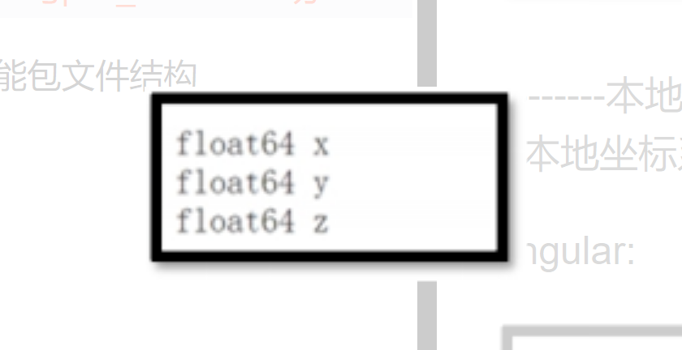

# 0. 进度：

11.4 -11.6 

1. 完成了系统流程学习，系统流程，

2. 需要学习了如何自定义消息类型
3. 如何发布自定义消息类型，c++ 发布和python 发布消息之间的区别
4. 服务端如何订阅消息，
5. 如何发送数据流，传输视频，发送到服务端
6. 实际开发无人机

11.7  -11.13号 

1. opencv 如何识别，文件框架
2. 如何传输的数据，谁订阅的谁，怎么发送的
3. 舵机如何控制，转动舵机，注意： 舵机上有两个接口，查淘宝看看使用哪个插口
4. 找到shell 脚本中的launch文件位于哪
5. px4 飞控  底层控制   起飞降落， marvos 通信 
6. neza_shell 启动脚本不对，还需要到原系统中找启动文件。
7. 嘉创无人机有 原公司镜像备份   NX
8. 博创尚和 无人机 有无原公司镜像备份   nano
9. 消息接收发送有限制，发送运行多次后会出现断连的现象 ，试验后，没有出现
10. pyqt 界面没有图片，不够美观

11月 9号

1. 拿到了嘉创无人机，NX 板，今天拆解了嘉创无人机，拍摄了拆卸视频
2. 学习了解了一些嘉创无人机
3. 接下来 准备调试 博创的无人机，感觉嘉创的无人机里面的东西很杂，博创尚和的无人机里面的资料很全
4. 调试博创的无人机。
5. 方向1 ： 在嘉创的无人机上加入 视觉，都得重新搭，
6. 今天调试博创尚和的无人机
7. 嘉创无人机没有视觉处理的方面，还需要学习博创尚和无人机的视觉
8. 在测试，博创尚和的无人机，中的 easy 文件中，t265 没有z轴数据，在运行Middle 脚本中，发现t265 摄像头 有z 轴数据
9. 

11 月 14  号 

1. 购买了新的内存卡，烧录的新的镜像，使用  鱼香ros 安装了ros ，二进制安装了Mavros , 导入了px4_command  catkin_make 没有报错，加入了realsense 功能包，出了一些问题。
2. 通过直接git clone github 没有反应，或者拒绝连接，这个 问题目前还没有解决
3. 写两个脚本，一个带服务器，一个不带服务器，两个运行主程序，
4. nano 用nomain 登录


11.20 号


1. 今天解决了opencv_bridge 中的opencv文件不存在的问题，原因在 jeston 是opencv4 ，更改 ros/share/cv_bridge 中的cv_bridegCongfig.cmake 中的路径
2. 

12.14 号 

1. 购买了阿木实验室的Mavros 教程 -offboard模式下自主飞行
2. 


12.16 

1. 接线成功， mavros 通信成功
2. 配置了固定ip地址
3. 设置了文件传输vsftpd ，网络文件传输


# 1.名称： 智能物流搬运无人机

# 2. 版本号：2.0

# 3. 开发者： 太原工业学院晋速-哪吒队

# 4. 开发环境：

## C++,python,linux,shell,xml,

## pyqt5,Qtdesigner,socket,

## opencv, ros, slam ubuntu18.04

# 5. 运行环境：

## jeston nano  jeston  Xavier NX 

# 6.无人机详解

## 1. 博创尚和

### 1. 节点

1. 通讯节点， px4 与ros通讯节点
2. 

### 报错：

1. 一般这样使用就ok了，至于出现的WARN，比如丢失head_camera.yaml这样的配置文件；由于相机本身不支持自动对焦导致unknown control ‘focus_auto’这样的问题，都没有关系。相机本身的基本功能，提供图像，已经实现了，使用rqt工具或者在rviz中都可以查看。 

```http
https://blog.csdn.net/cgy8919/article/details/53064991?ops_request_misc=&request_id=&biz_id=102&utm_term=unkonw%20control%20%20%27focus_auto%27&utm_medium=distribute.pc_search_result.none-task-blog-2~all~sobaiduweb~default-1-53064991.142^v63^control,201^v3^control_2,213^v2^t3_control2&spm=1018.2226.3001.4187
```

2. px4 报错，飞控固件不适配，
3. nano 连接mavros 

```http
https://blog.csdn.net/ZDPZN/article/details/120223096?spm=1001.2014.3001.5502
```


## 2. 嘉创飞航


## 3. 白飞机


# 7. 运行流程


# 8. 公司飞机

## 1. 嘉创飞航

nx

## 2. 博创尚和

nano

shell -  > launch -> cpp 


## 3. 阿木实验室

### 0.  nx 和 px4 接线

```http
https://blog.csdn.net/weixin_53670039/article/details/123387203?ops_request_misc=%257B%2522request%255Fid%2522%253A%2522166815017916800192270527%2522%252C%2522scm%2522%253A%252220140713.130102334.pc%255Fall.%2522%257D&request_id=166815017916800192270527&biz_id=0&utm_medium=distribute.pc_search_result.none-task-blog-2~all~first_rank_ecpm_v1~rank_v31_ecpm-1-123387203-null-null.142^v63^control,201^v3^control_2,213^v2^t3_control2&utm_term=nx%E9%85%8D%E7%BD%AEmavros&spm=1018.2226.3001.4187
```


Jetson nano 使用ROS 实现串口通信
1：首先安装ros下的serial库
sudo apt-get install ros-melodic-serial
其中的melodic根据自己的ros版本来修改
2：安装minicom和cutecom来首次检查串口是否通信成功
sudo apt-get install minicom
sudo apt-get install cutecom
3：将自己的串口设备连接到jetson nano上


 jetson nano的引脚4 6 8 10 分别是VCC GND TX RX
对应引脚接好之后 应该是对应系统内的**/dev/ttyTHS1**设备
**sudo chmod 777 /dev/ttyTHS1 使用该命令给串口权限** 


### 1. 代码来源

阿木实验室  p200 无人机

```http
https://amov-wiki.readthedocs.io/zh_CN/latest/docs/%E6%96%B0%E6%89%8B%E5%85%A5%E9%97%A8.html
```

以下为px4_command 功能包。

```http
https://gitee.com/theroadofengineers/px4_command
```

先安装 Mavros 再安装px4_command 


px4_command,mavros -> t265  rivz   tft 坐标 ->  volo v7 -> 舵机-> socket


**Camera_com：**

自定义的摄像头功能包，存放着与单目USB摄像头有关的程序，底层调用ROS官方功能包usb_cam获取图像和控制摄像头，目前里面暂时只有一个控制摄像头拍照和录像的python程序，开发者与摄像头有关的程序可以放到这里。

**Nlink_parser：**

暂时没有用到，不用管。

**Px4_com：**

功能包名称为px4_command，是一个由阿木(AMOV)实验室研发并开源的一款基于px4自驾仪控制的底层级软件工具包，存放着与飞行控制有着直接关系的代码，通过接受或调用其他功能包节点的数据或服务进行控制，可以在这里开发飞行程序和修改飞行参数，下一章节会重点讲解。

**Ros_slam：**

自定义的slam算法功能包，存放着上层slam算法有关的应用级代码，为px4_com中的飞行控制规划路径，开发的slam算法放在这里。

**Rplidar_ros：**

激光雷达的功能包，由思岚科技官网提供，直接下载编译即可使用。

**Serial_port：**

自定义的串口功能包，存放与外接串口模块(例如zigbee模块，SIM卡模块等)通信程序，底层调用的是ROS官方功能包serial。

**Track_pkg：**

自定义的视觉追踪功能包，其实这个功能包应该放到vision_ws工作空间；此功能包主要提供图像处理，底层调用ROS官方功能包usb_cam获取图像和控制摄像头，cv_bridge和image_transport进行图像数据传送与转化，目的是让图像能被opencv进行处理。


### 2. 模拟部署流程

参考网站：

```http
https://blog.csdn.net/qq_36098477/article/details/115489986?spm=1001.2014.3001.5502
```

ROS官方功能包安装路径——Lib文件夹：
在uav_ws和vision_ws工作空间中调用的ROS官方底层功能包在lib文件夹，每当通过

```shell
sudo apt-get install ros-melodic-xxxxxx
```

下载某个功能包后，会在/opt/ros/melodic/share/路径下生成一个对应的功能包文件夹，存放着这个功能包有关的消息类型，功能包属性，launch启动文件，rviz仿真文件等文件；同时会在/opt/ros/melodic/lib/路径下也生成一个对应的功能包文件夹，里面存放着此功能包的节点的二进制可执行文件和执行脚本。

ROS无人机主要用到的官方功能包如下所示

#### 0. ROS

可以用 鱼香ros ，先换源，再进行安装

先安装ros，测试小乌龟后，再执行下面的部署流程

参考网站：

```http
https://blog.csdn.net/Zhang_Chen_/article/details/108014219?ops_request_misc=%257B%2522request%255Fid%2522%253A%2522166816929316782412528254%2522%252C%2522scm%2522%253A%252220140713.130102334..%2522%257D&request_id=166816929316782412528254&biz_id=0&utm_medium=distribute.pc_search_result.none-task-blog-2~all~sobaiduend~default-1-108014219-null-null.142^v63^control,201^v3^control_2,213^v2^t3_control2&utm_term=jeston%20nx%20%E5%AE%89%E8%A3%85ros&spm=1018.2226.3001.4187
```

关键字： jeston  Xavier NX     ROS


#### 1. RealSenseT265 追踪相机功能包

**命令**

```shell
sudo apt-get install ros-melodic-realsense-camera
```

**功能：**  

此功能包封装极度完善，直接开启T265相机并进行坐标计算和回传。 

**操作：**

```ssh
roslaunch realsense2_camera rs_t265.launch
```

 节点会将tf空间坐标和IMU等信息发布出来 

 **注意事项:** 

 终端当出现了RealSense Node Is Up!说明节点正常工作； 

 光线过暗或遮挡摄像头时，相机看不到环境，会出现报错

 rs_t265.launch所启动的两个节点只发布了位姿信息，没有发布双鱼眼相机的视频流 


rosnode list 查看节点信息

rostopic list  查看主题

rqt_graph    ros  计算图


#### 2. Mavlink与MAVROS功能包


参考网址：

```shell
https://blog.csdn.net/weixin_41331879/article/details/125495333?ops_request_misc=&request_id=&biz_id=102&utm_term=ubuntu18%E4%BA%8C%E8%BF%9B%E5%88%B6%E5%AE%89%E8%A3%85Mavros&utm_medium=distribute.pc_search_result.none-task-blog-2~all~sobaiduweb~default-4-125495333.142^v63^control,201^v3^control_2,213^v2^t3_control2&spm=1018.2226.3001.4187
```

关键词： ubuntu18   mavros 二进制安装


安装命令：

```shell
sudo apt install ros-melodic-mavros ros-melodic-mavros-extras


wget https://raw.githubusercontent.com/mavlink/mavros/master/mavros/scripts/install_geographiclib_datasets.sh
若拒绝连接
gedit install_geographiclib_datasets.sh
```

  报错，拒绝链接，以下是具体内容，我们新建一个文件，在自己想要的存放的位置输入以下指令,该指令的意思就是用gedit生成一个install_geographiclib_datasets.sh的文件，然后我们复制下方的代码拷贝到里面。 

```shell
#!/bin/bash
# Script to install the model datasets required
# to GeographicLib apply certain conversions
 
if [[ $UID != 0 ]]; then
	echo "This script require root privileges!" 1>&2
	exit 1
fi
 
# Install datasets
run_get() {
	local dir="$1"
	local tool="$2"
	local model="$3"
 
	files=$(shopt -s nullglob dotglob; echo /usr/share/GeographicLib/$dir/$model* /usr/local/share/GeographicLib/$dir/$model*)
	if (( ${#files} )); then
		echo "GeographicLib $tool dataset $model already exists, skipping"
		return
	fi
 
	echo "Installing GeographicLib $tool $model"
	geographiclib-get-$tool $model >/dev/null 2>&1
	
	files=$(shopt -s nullglob dotglob; echo /usr/share/GeographicLib/$dir/$model* /usr/local/share/GeographicLib/$dir/$model*)
	if (( ! ${#files} )); then
		echo "Error while installing GeographicLib $tool $model"
		return
	fi
}
 
# check which command script is available
if hash geographiclib-get-geoids; then
	run_get geoids geoids egm96-5
	run_get gravity gravity egm96
	run_get magnetic magnetic emm2015
elif hash geographiclib-datasets-download; then # only allows install the goid model dataset
	geographiclib-datasets-download egm96_5;
else
	echo "OS not supported! Check GeographicLib page for supported OS and lib versions." 1>&2
fi
```


 保存并退出输入以下指令 

```shell
sudo bash ./install_geographiclib_datasets.sh 
```

检测是否成功

```shell
roscd mavros
```


 **作用：** 

 此功能包采用mavlink协议可直接对烧录了PX4固件的自驾仪进行通信，只需要编写上层程序进行调用和控制即可，此功能包直接对接于PX4_com功能包和自驾仪。 

 **操作：** 

```shell
roslaunch mavros px4.launch fcu_url:="/dev/ttyTHS1:921600"
```

因为nano与自驾仪是依靠串口通信的，所以后面fcu_url:="/dev/ttyTHS1:921600"指的是串口设备文件与波特率，根据实际情况选择。

 出现以下信息说明节点工作正常： 


疑问：

此为二进制安装还是源码安装，阿木实验室需要什么安装？  二进制安装

阿木实验室需要什么飞控固件？   未知


#### 3. Serial底层串口驱动与应用级功能包

**安装方法(可能已经内置)：**

```shell
sudo apt-get install ros-melodic-serial
```

**操作：**

```c++
#include <serial/serial.h>
```

即可

此功能包没有实体节点，使用体现在与头文件调用上，通过调用此功能包函数可以快速的进行串口收发操作

#### 4. USB-CAM摄像头功能包

安装方法：

```shell
sudo apt-get install ros-melodic-usb-cam
```

操作：

```shell
roslaunch usb_cam usb_cam-test.launch
```

即可运行有关于USB摄像头的节点并将摄像头信息和图片发布出去，运行成功后会自动运行rqt工具包中的image_view工具，自动显示图像，其他算法类节点可订阅此消息进行图像接收与处理。


### 3. MAlink协议,MAVROS 与px4_command 功能包


#### 1. 简介 

机载处理器与飞行控制器之间依靠 mavlink 通讯协议进行通信。

MavLink（Micro Air Vehicle Link）是一种用于小型无人载具的**通信协议**，于 2009 年首 次发布。该协议广泛应用于地面站（Ground Control Station，GCS）与无人载具（Unmanned vehicles）之间的通信，同时也应用在载具内部子系统的内部通信中，协议以消息库的形式 定义了参数传输的规则。MavLink 协议支持无人固定翼飞行器、无人旋翼飞行器、无人车辆 等多种载具。而 mavros 则是连接 ros 与 mavlink 之间的桥梁，是将 mavlink 协议翻译成 ros 可以读懂 的 topic 的“翻译官”。


**Mavros 包可以读取飞控反馈回来的各种数据，发送给 Ros 其他节点使用，也可以发布 位置控制，速度控制，加速度控制指令，下面来介绍一下 mavros 控制指令:**

#### mavros 功能包:

#### 2. 位置控制 

 主题名称：   /mavros/setpoint_position/local 

 发布坐标系：NED 坐标系 (需要特别注意)

 参数：geometry_msgs/PoseStamped Message 

 Geometry_msgs/PoseStamped 包含的内容：  其中 Point 是指无人机目标位置，Quaternion 是指无人机目标姿态 


 **Point 含义：** 

x-------本地坐标系下前后位置，前为正，后为负 

y-------本地坐标系下左右位置，左为正，右为负

z-------本地坐标系下高度位置，上为正，下为负


 **Quaternion 含义：** 

这是一个四元数，

x-----俯仰，

y-----滚转，

z，w-----两个参数共同组成偏航角 


####  3. 速度控制： 

主题名称：/mavros/setpoint_velocity/cmd_vel_unstamped

发布坐标系：NED坐标系

参数：geometry_msgs/Twist

 Twist 包含内容： 


 linear 含义： 


 x-------本地坐标系下前后速度，前为正，后为负 

y-------本地坐标系下左右速度，左为正，右为负

 z-------本地坐标系下高度速度，上为正，下为负


 angular: 




 z-------本地坐标系下旋转速度，左为正，右为负 


#### 4.  **加速度控制：** 

主题名称：/mavros/setpoint——accel/accel 发布坐标系：NED 坐标系

参数：geometry_msgs/Vector3Stamped


x-------本地坐标系下前后加速度，前为正，后为负

y-------本地坐标系下左右加速度，左为正，右为负

z-------本地坐标系下高度加速度，上为正，下为负


#### PX4_command 功能包：

 为了更直观的控制和使用，px4_command自定义了一套通信协议与 mavros 进行通讯，

自定义协议结构体如下图所示


#### 1. 指令分析

- comid---指令的 id，用于区分指令序列
-  command---指令类别
  -  Move_ENU：ENU 坐标系下运动 
  - Move_Body：机体坐标系下运动
  - Hold：悬停指令
  - Land：降落指令
  - Disarm：上锁指令
  - Failsafe_land：紧急降落
  -  Custom：自定义 

- Sub_mode---子命令，指明该指令是速度还是位置指令
- Pose_sp---位置指令
  - 0：x 方向
  - 1：y 方向
  - 2：z 方向

- Vel_sp---速度指令
  - 0：x 方向
  - 1：y 方向
  - 2：z 方向

- Yaw_sp---航向位置指令

- Yaw_rate_sp---转向速度指令


 rqt_graph 


### 4. 客服资料

mavros  下的  offboard 教程

```
链接:https://pan.baidu.com/s/1Q4pro3gE-ymJjGyKjuLKtA 
提取码:amov
```

px4_command 教程代码

```
代码仓：https://gitea.amovlab.com/


PX4代码：https://gitea.amovlab.com/BobeiCollege/Prometheus
```


# 9. 仿真

   gazebo9.19

阿木实验室 普罗修斯

```
https://wiki.amovlab.com/public/prometheus-wiki/Prometheus%E7%9C%9F%E6%9C%BA%E6%95%99%E7%A8%8B/%E7%9C%9F%E6%9C%BA%E5%AE%9E%E9%AA%8C/%E7%9C%9F%E6%9C%BA%E5%AE%9E%E9%AA%8C.html
```


