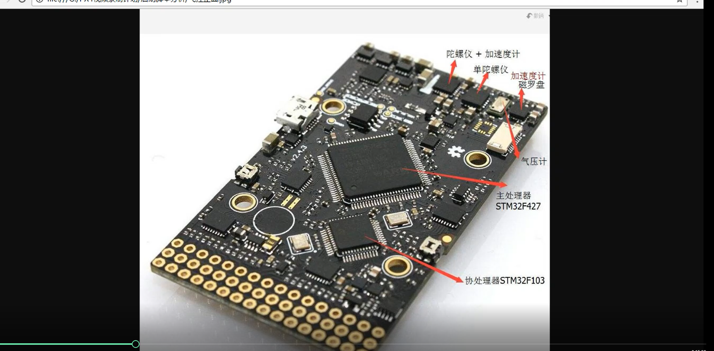
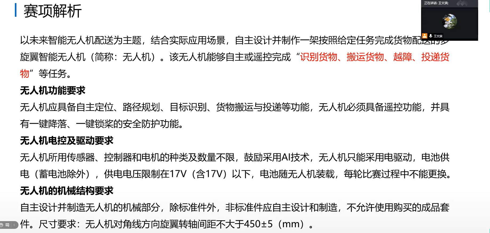

# 0 . 不懂的地方

1.  飞控地面机控制使用 qgroud
2. ros  
3. xml  launch 
4. VINS 
5.  电机和机架的选择与配合
6.  香蕉头成对购买（40A)  50个
7.  XT60接头 （成对）   20个
8.  螺旋桨 （型号） （多买 50个）
9.  电机 ，电调（待定）‘
10.  显示屏 （2个）、
11.  铝方管（10mm 10mm 壁厚1mm）
12.  减震棉 （铺地下）（蓝色减震棉）（先买一部分看看）
13.  学长的飞机调pid 调的不稳定，原因在一个螺丝没有拧紧，
14.  为什么在Ubuntu上安装  qgcround 
15.  激光，安装在货舱下（同时看对yolo识别有无影响）
16.  买，灯，蓝，绿，灯安装在机臂下


# 一 . 硬件部分

## 0. 接线

### gps

### 电流计

### 电调

### 接收机

### 接收机与遥控器


GASS: [无人机自动驾驶硬件系列 E01：从 0 开始组装测试用无人机 - GAAS (gitbook.io)](https://gaas.gitbook.io/guide/build-your-own-autonomous-drone-hardware-implementation/gaas-shi-pin-jiao-xue-xi-lie-cong-0-kai-shi-zu-zhuang-ce-shi-yong-wu-ren-ji) 


## 多旋翼无人机的组成


## 电调：

 电调，全称电子调速器，使用支持额定电流35A以上，须支持Dshot协议


## 电机：

KV值一定都要在2400左右，

什么是KV：

电机转速（空载） = KV* 电压

## 机载电脑：


## 传感器：

英特尔的 Realsense D435 用到了双目图像和深度图像


## 机架


```http
很简单，就是dxf文件打包发给厂子，这要还不会那我教不了了
链接：https://pan.baidu.com/s/12Lt-aGTw4FkKNKBn3Lp1Nw 
提取码：XMFP
```

做好减震，减震棉


# 二  .软件部分 

## 1. 配置飞控

下载 QGroundControl


## 2. ubuntu 系统

###  1. 安装ros

### 2. 安装 realsense 驱动

### 3. 安装 mavros 

### 4. 安装ceres 与glog 

### 5. 安装 Ddynamic- reconfigure 

### 6. 安装vscode 

### 7. 安装 terminator  

   可将终端分成多个

### 8. 安装 plotjuggler 

### 9. 安装 net - tools 

查看 ip 

### 10. 安装 nomachine 

远程桌面软件 

### 11. 安装ssh 与设置别名

使用ping 命令，连接正常

## 3. src 

 

### 1. planner 

   导航建图  以及  自主避障相关的代码

####     1.bsplineo_opt 

​      这个是bsplineoptimizer 的文件代码，包含所有的优化函数

####     2. drone_detect 

####     3. path serching 

​     这里面主要是有一个 A* 算法的代码

####     4. plan_env 

​	就是plan environment 这个是建图代码是放在这里

####     5. plan manage 

   这个就是这整一个函数的入口


#### 6. rosmsf_tcp_bridge 

   多机 集群通讯  


#### 7. 需要改的参数：

1. 你期望的速度
2. 膨胀的大小
3. 地图的分辨率

 注意点：

 膨胀大小不超过 分辨率的四倍

### 2. reakflighe modules  

 顾名思义 这个代码能够在真实的飞机上运行的时候所需要配套的


无人机的重量

### 3. uavsimulator  这个就是仿真的代码

第二部分和第三部分在运行的时候是二选一的

真飞机上部署，需要运行第二个，在电脑上跑仿真需要  运行第三个


### 4. utils  公用的代码

​    比如共用的ros 的topic 之类， 初学者可以先不用管他们


 


# 三. 课外资料

## 1. 无人机控制器 

### 1. stm32 飞控


```html
https://x.jlc.com/platform/detail/51a7f8c3fc494b24911d4e06fddd93db
```

### 2. 基于V3s的Linux 飞控


```html
https://x.jlc.com/platform/detail/3ca5233e6c884056b0460dae58101485
```

### 3. ESP32 主控


```html
https://x.jlc.com/platform/detail/bf7fa923130f43f9a64cce9698cae3d1
```

### 4. stm32f1 飞控


```html
https://x.jlc.com/platform/detail/e328f60a8ade48dd8c801c852c276f77
```

# 四. 调试PX4

## 1.安装QGC 


```http
https://docs.qgroundcontrol.com/master/en/getting_started/download_and_install.html
```

## 2. 刷新固件 校准传感器


### 方法步骤：

1.  将无人机静止放在水平面上
2. 点击陀螺仪，点击陀螺仪，开始校准陀螺仪
3. 点击加速度计  按图中位置摆放无人机，校准通过的姿态会变绿， 校准通过后更换其他姿势。
4. 校平 地平分线  等待无人机自动校准完成


## 3. 选择机架


## 4. 遥控器校准和飞行模式选择


### 方法：

1. 按照软件提示拨动摇杆

2. 选择通道5为模式选择，三种模式，自稳 悬停  自主避障

   

### 疑问：

1. 遥控器和地面站怎么连接


## 5. 电池设置和电调校准


### 方法：

1. 选择电芯数量   
2. 空电 电压  3.7 满电电压 4.2   此时不要给无人机连接电池   
3. 点击校准 这是提示我们连接电池  我们连接电池后，电调会自动校准 等待电机鸣叫完成后，校准完成
4. 用万用表测量电池电压，再填入


# 五. 无人机材料


- 缓冲棉  加网布 

- 做一个控制架  调pid   


# 六. Pix hawk 二次开发  阿木实验室

```http
https://www.bilibili.com/video/BV1oo4y1R7vC?spm_id_from=333.337.search-card.all.click&vd_source=b374b33615ea684460399a3e87800734
```

## 0. 听课日志

- 8.17         计划 p15      实际 


## 1.飞控软硬件介绍


- 原生固件  用ggroundcontrol 
- autopoilt 固件用 MissionPlanner
- px4 可以使用两种固件


## 2. 传感器特性

### 1.1 IMU 

 


### 1.2 减少传感器误差的方法


 

  

- 陀螺仪校准
- 加速度校准
- 磁力计校准  通电   电机全速运行   看磁力计有没有报错

### 1.3 电调校准

## 3. QGC 界面部分

### 1固件下载


### 2 载具选择

### 3 遥控器校准

### 4.传感器校准T

### 5飞行模式

### 6电调校准

### 7参数设置

### 8 航点设置

### 9数据分析预览

### 10光流预览

### 11遥测白志预览


## 4.启动脚本分析




- 主协处理器之间采用串口通信
- 双mu 提高稳定性

 


## 5. 系统软件框架及其代码编译


## 6. pixhawk 编译脚本分析与调试手段


# 七.PX4  调参

## 1.pid 调参的基本规则

- p参数可以提高响应速度
- p过大：超调或发散，产生高频震荡
- p过小：响应变慢，控制感不足

# 八. 智能配送无人机赛题分析

## 1. 赛项解析




## 竞赛场地


## 搬运的货物


## 注意点 

- 障碍物的摆放位置是活动的
- A区标靶  不同环  不同分数
- B区 图形 Z H W  中任意一个图形
- C区 放置 人  车  房子   任意一个贴图
- 放置货物，飞机飞的尽可能低


